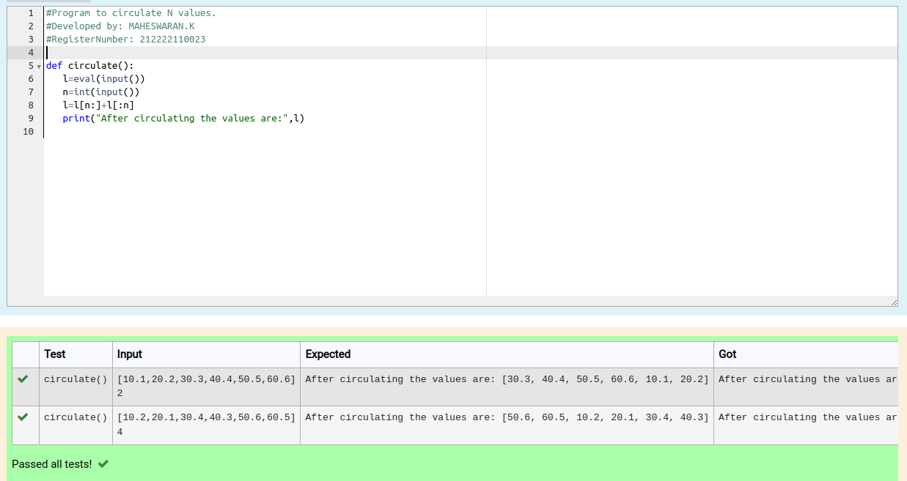

# Circulate-the-values-of-N-variables
## Aim:
To write a python program to circulate the n variables using function concept
## Equipment’s required:
PC
Anaconda - Python 3.7
## Algorithm: 
### Step 1: 
Use the function Circulate.
### Step 2: 
Assign variables into List.
### Step 3: 
Get the value from the user for the number of rotation
### Step 4: 
Using the slicing concept rotate the list
### Step 5:
Print the Result.
### Step 6: 
End the Program.
## Program:
```
#Program to circulate N values.
#Developed by: MAHESWARAN.K
#RegisterNumber: 212222110023

def circulate():
   l=eval(input())
   n=int(input())
   l=l[n:]+l[:n]
   print("After circulating the values are:",l)
```

## Output:


## Result:
The above python program to circulate the n variables using function concept.
